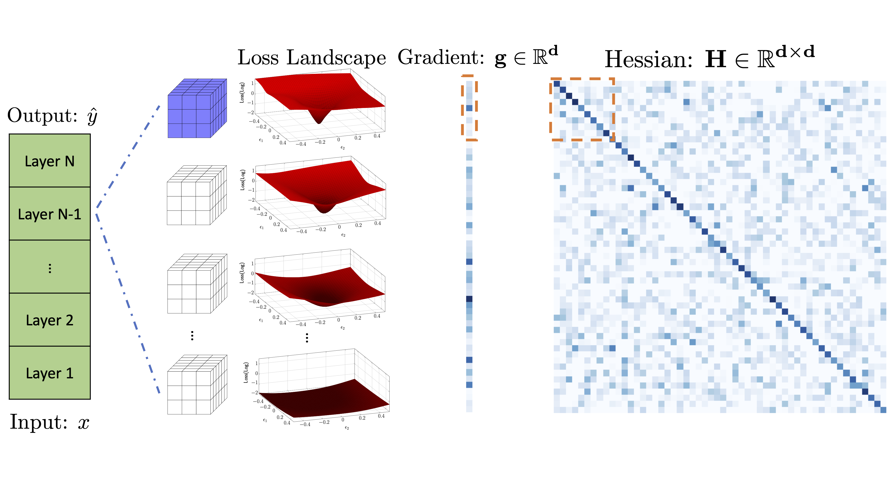
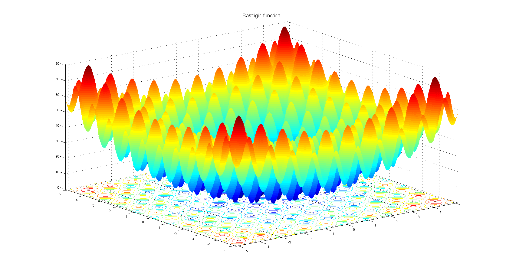

## Introduction


AdaHessian is a second order based optimizer for the neural network training based on PyTorch. The library supports the training of convolutional neural networks ([image_classification](https://github.com/amirgholami/adahessian/tree/master/image_classification)) and transformer-based models ([transformer](https://github.com/amirgholami/adahessian/tree/master/transformer)). Our TensorFlow implementation is [adahessian_tf](https://github.com/amirgholami/adahessian/tree/master/adahessian_tf).

Please see [this paper](https://arxiv.org/pdf/2006.00719.pdf) for more details on the AdaHessian algorithm.

For more details please see:

- [Video explanation of AdaHessian](https://www.youtube.com/watch?v=S87ancnZ0MM)
- [AdaHessian paper](https://arxiv.org/pdf/2006.00719.pdf).

## Performance on Rastrigin and Rosenbrock Fucntions:
Below is the convergence of AdaHessian on Rastrigin and Rosenbrock functions, and comparison with SGD and ADAM. Please see [pytorch-optimizer](https://github.com/jettify/pytorch-optimizer) repo for comparison with other optimizers.


| Loss Function | AdaHessian      | SGD         | ADAM        |
|-------------- |-----------------|-------------|-------------| 
| |   |   |   |
| |   |   |  |


## Installation -- Git (Recommended)
Please first clone the AdaHessian library to your local system:
```
git clone https://github.com/amirgholami/adahessian.git
```
You can import the optimizer as follows:

```python
from optim_adahessian import Adahessian
...
model = YourModel()
optimizer = Adahessian(model.parameters())
...
for input, output in data:
  optimizer.zero_grad()
  loss = loss_function(output, model(input))
  loss.backward(create_graph=True)  # You need this line for Hessian backprop
  optimizer.step()
...
```

Please note that the optim_adahessian is in the image_classification folder. We also have adapted the Adahessian implementation to be compatible with fairseq repo, which can be used for NLP tasks. This is the [link](https://github.com/amirgholami/adahessian/blob/master/transformer/fairseq/optim/adahessian.py) to that version, which can be found in transformer folder.

## Installation -- Pip
If you are interested to install the library through pip, then we recommend doing so through pytorch-optimizer package as follows:

```
$ pip install torch_optimizer
```

```python
import torch_optimizer as optim

# model = ...
optimizer = optim.Adahessian(
    m.parameters(),
    lr= 1.0,
    betas= (0.9, 0.999)
    eps= 1e-4,
    weight_decay=0.0,
    hessian_power=1.0,
)
      loss_fn(m(input), target).backward(create_graph = True) # create_graph=True is necessary for Hessian calculation
optimizer.step()
```

## For different kernel size (e.g, matrix, Conv1D, Conv2D, etc)
We found out it would be helpful to add instruction about how to adopt AdaHessian for your own models and problems. Hence, we add a prototype version of AdaHessian as well as some useful comments in the instruction folder. 


## External implementations and discussions
We are thankful to all the researchers who have extended AdaHessian for different purposes or analyzed it. We include the following links in case you are interested to learn more about AdaHessian.

Description | Link | New Features
---|---|---
External Pytorch Library Implementation | [Link](https://github.com/jettify/pytorch-optimizer) | --
Reddit Discussion | [Link](https://www.reddit.com/r/MachineLearning/comments/i76wxd/adahessian_an_adaptive_second_orderoptimizer_for/) | --
Fast.ai Discussion | [Link](https://forums.fast.ai/t/adahessian/76214/15) | -- 
Best-Deep-Learning-Optimizers Code| [Link](https://github.com/lessw2020/Best-Deep-Learning-Optimizers/tree/master/adahessian) | --
ada-hessian Code | [Link](https://github.com/davda54/ada-hessian) | Support Delayed Hessian Update
JAX Code | [link](https://github.com/nestordemeure/AdaHessianJax) | --
AdaHessian Analysis | [Link](https://github.com/githubharald/analyze_ada_hessian) | Analyze AdaHessian on a 2D example

## Citation
AdaHessian has been developed as part of the following paper. We appreciate it if you would please cite the following paper if you found the library useful for your work:

```text
@article{yao2020adahessian,
  title={ADAHESSIAN: An Adaptive Second Order Optimizer for Machine Learning},
  author={Yao, Zhewei and Gholami, Amir and Shen, Sheng and Keutzer, Kurt and Mahoney, Michael W},
  journal={AAAI (Accepted)},
  year={2021}
}
```

## Copyright

THIS SOFTWARE AND/OR DATA WAS DEPOSITED IN THE BAIR OPEN RESEARCH COMMONS REPOSITORY ON 02/27/23.
