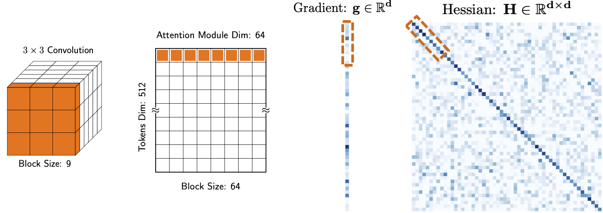

Here we include instrutions on how to use the block averaging used in AdaHessian for different kernel sizes (e.g. matrix, 1D Conv, 2D Conv, etc). 
The instruction is written based on the adahessian.py file in this directory. 
In particular, in Lines 105 -- 156 [here](https://github.com/amirgholami/adahessian/blob/master/instruction/adahessian.py),
we show how to use block averaging for various different kernels. For 1D, 3D, and 4D tensors, we give two choices to set the spatial averaging. 
Instructions are included in the comments. 

The current format of AdaHessian is the same as general PyTorch optimizer except when you need to set 
```
loss.backward(create_graph=True)
```
Please refer to [here](https://github.com/amirgholami/adahessian/blob/master/image_classification/main.py) for the image classification example. 


